# MVPChat Architecture Diagrams

Visual representation of the StoriesChat codebase structure, data flows, and dependencies.

---

## 1. System Architecture Layers

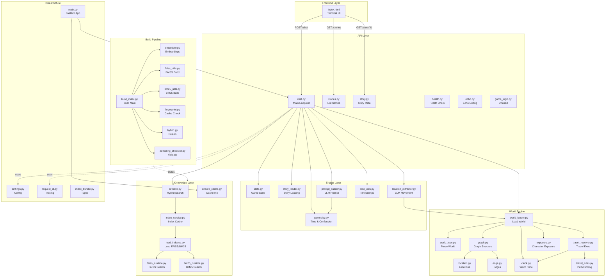

---

## 2. Chat Turn Request Flow

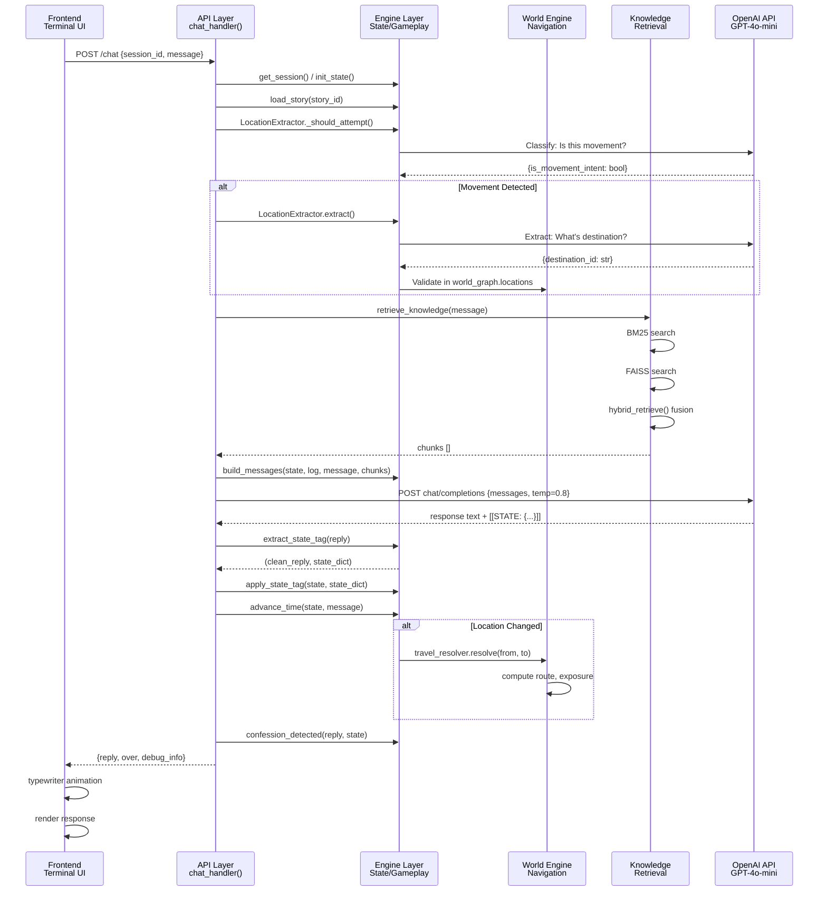

---

## 3. Knowledge Retrieval Pipeline

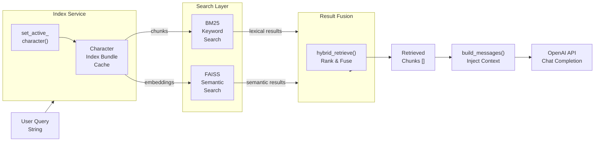

---

## 4. World System Architecture

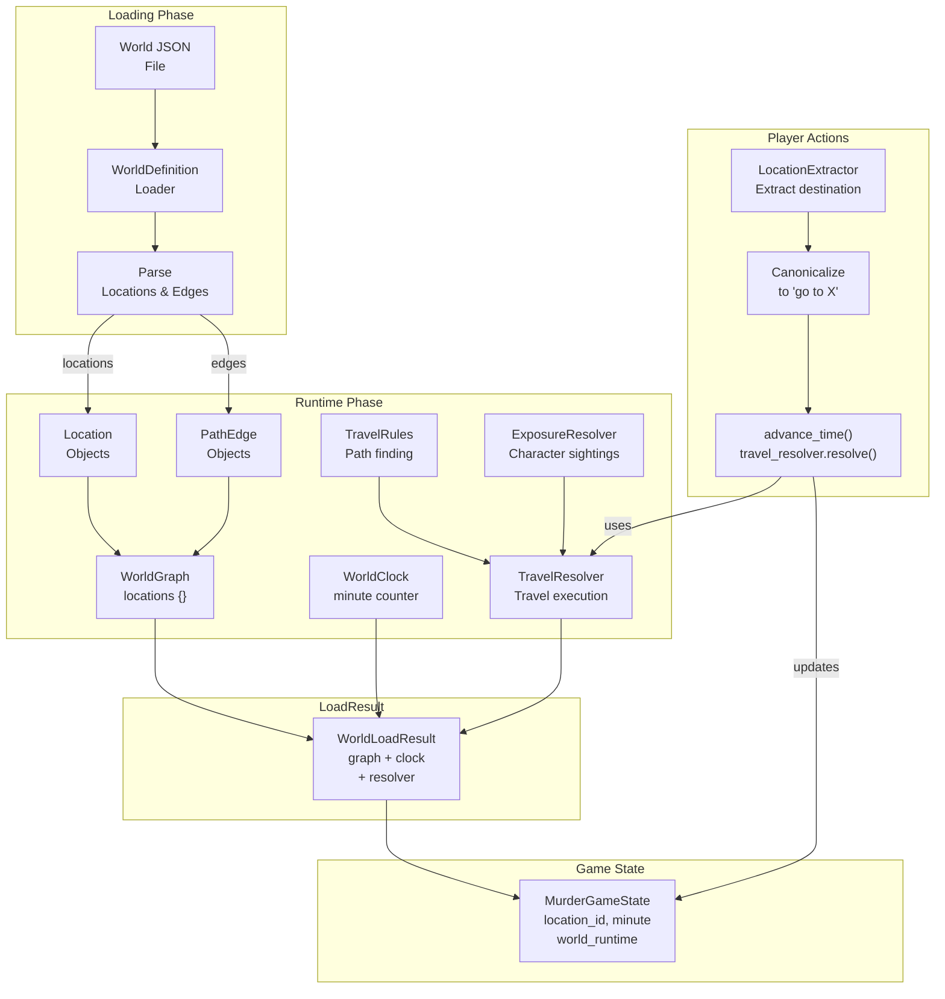

---

## 5. State Management & Updates

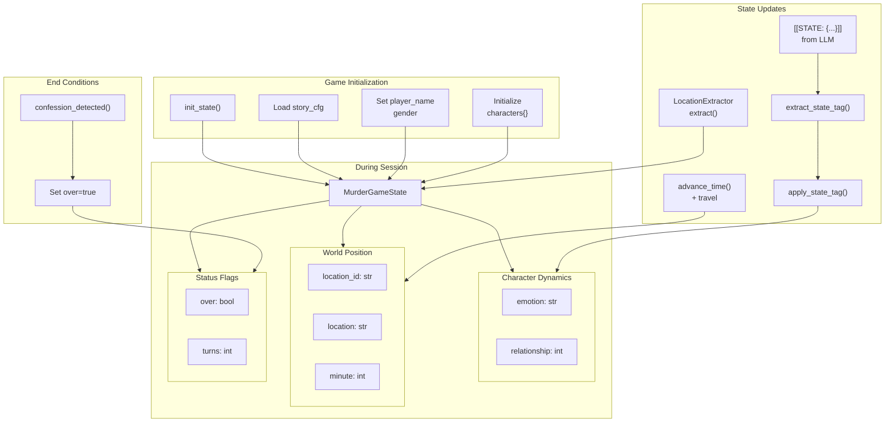

---

## 6. LLM Integration Points

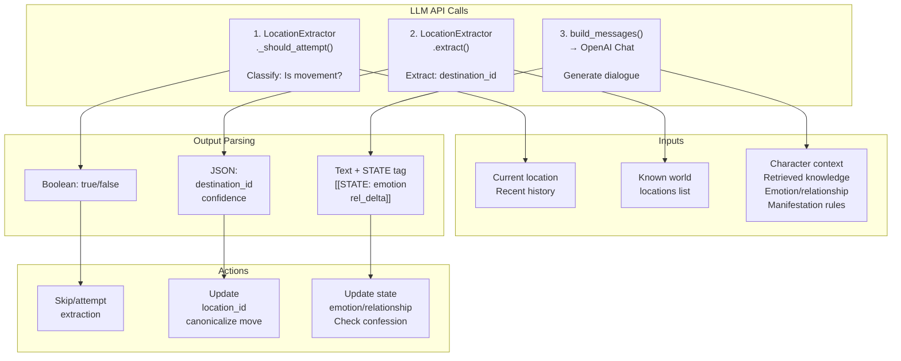

---

## 7. File Dependency Graph

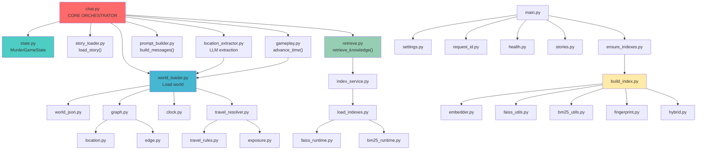

---

## 8. Class Hierarchy & Relationships

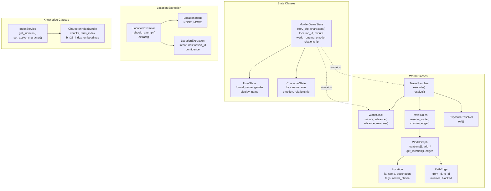

---

## 9. Data Flow: Complete Chat Turn

```mermaid
graph LR
    Input["User Input<br/>Message String"]
    
    Input -->|Parse| Parse["Command?<br/>Debug Toggle?<br/>Normal Msg?"]
    
    Parse -->|New Game| NewGame["__cmd_newgame__<br/>Load Story<br/>Init State<br/>Load World"]
    Parse -->|Normal| Process["Extract Name?<br/>Location?"]
    
    NewGame --> Loaded["State Ready<br/>With Story Config"]
    
    Process -->|Name Detect| NameConfirm["Ask Confirm<br/>Return prompt"]
    Process -->|No Name| ContinueTurn["Continue Turn"]
    
    NameConfirm -->|Yes| UpdateName["Update state<br/>player_name"]
    NameConfirm -->|No| AskAgain["Retry"]
    
    UpdateName --> ContinueTurn
    
    ContinueTurn -->|Extract Location| LocExt["LocationExtractor<br/>._should_attempt()<br/>.extract()"]
    LocExt -->|Move Detected| CanonMove["Canonicalize:<br/>go to {dest_id}"]
    LocExt -->|No Move| OrigMsg["Keep original msg"]
    
    CanonMove --> Retrieve["retrieve_knowledge()<br/>BM25 + FAISS<br/>Hybrid fusion"]
    OrigMsg --> Retrieve
    
    Retrieve --> Knowledge["Chunks []"]
    Knowledge --> BuildMsg["build_messages()<br/>System prompt<br/>Memory block<br/>History"]
    
    BuildMsg --> Messages["OpenAI message list"]
    Messages --> LLM["POST chat/completions"]
    
    LLM --> Reply["LLM response<br/>text + STATE tag"]
    Reply -->|Parse| ParseTag["extract_state_tag()"]
    
    ParseTag --> Clean["Clean reply<br/>State dict"]
    
    Clean -->|Apply| ApplyState["apply_state_tag()<br/>Update emotion<br/>Update relationship"]
    ApplyState --> StateUpdated["State modified"]
    
    Clean -->|Time| AdvanceTime["advance_time()<br/>Word count → minutes<br/>Location changed?"]
    AdvanceTime -->|Yes| Travel["travel_resolver.resolve()<br/>Add travel time<br/>Roll exposure"]
    AdvanceTime -->|No| NoTravel["Just increment minute"]
    
    Travel --> TimeAdvanced["Minute updated"]
    NoTravel --> TimeAdvanced
    
    StateUpdated --> Check["confession_detected()?"]
    Check -->|Yes| Won["over = true<br/>Show ending"]
    Check -->|No| Reply2["over = false<br/>Continue game"]
    
    Won --> Output["Return<br/>reply + over<br/>+ debug_info"]
    Reply2 --> Output
    
    Output --> Frontend["Send to Frontend<br/>Typewriter effect"]
```

---

## 10. Build & Deployment Pipeline

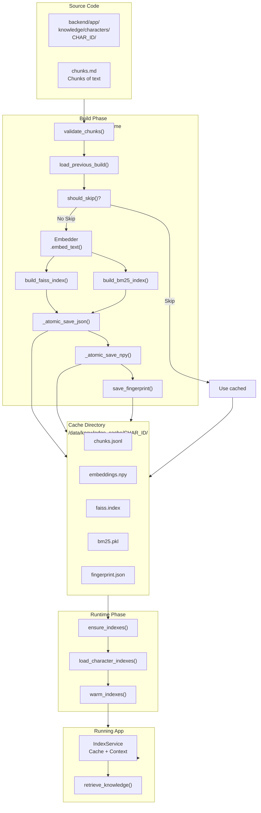

---

## 11. Unused Code Diagram

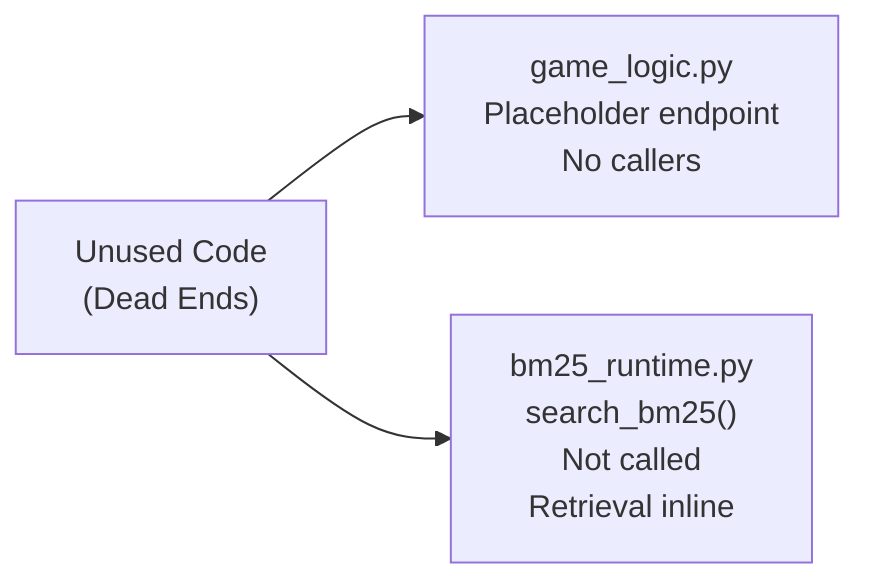

---

## 12. Key Metrics

```
┌─────────────────────────────────────────────────┐
│  Code Statistics                                │
├─────────────────────────────────────────────────┤
│  Backend Python Files              39           │
│  Backend Classes                   ~40          │
│  Backend Methods/Functions         ~150         │
│  Frontend JS Functions             ~30          │
│                                                 │
│  LLM API Calls Per Turn             3           │
│  │ 1. Classification                            │
│  │ 2. Destination Extraction                    │
│  │ 3. Dialogue Generation                       │
│                                                 │
│  State Transitions Per Turn        ~5           │
│  │ Location, Minute, Emotion, Etc.              │
│                                                 │
│  Knowledge Indexes                 2           │
│  │ FAISS (semantic)                             │
│  │ BM25 (lexical)                               │
│                                                 │
│  Unused Functions                  2           │
│  All Other Functions              ~148 (98%)    │
│                                                 │
│  Layers                            5           │
│  │ Frontend → API → Engine →                    │
│  │ World → Knowledge                            │
└─────────────────────────────────────────────────┘
```

