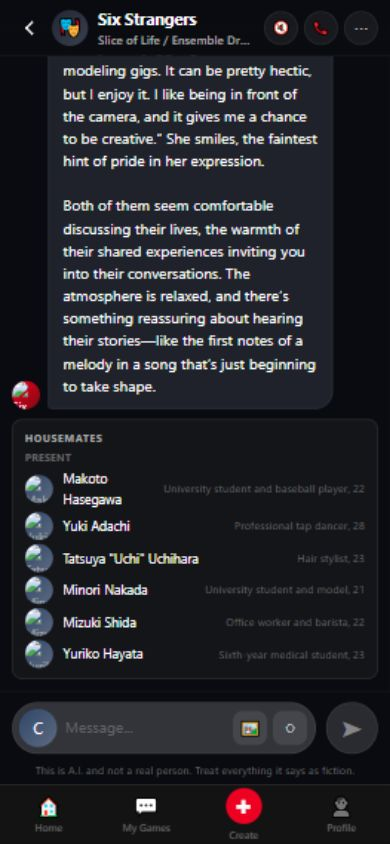
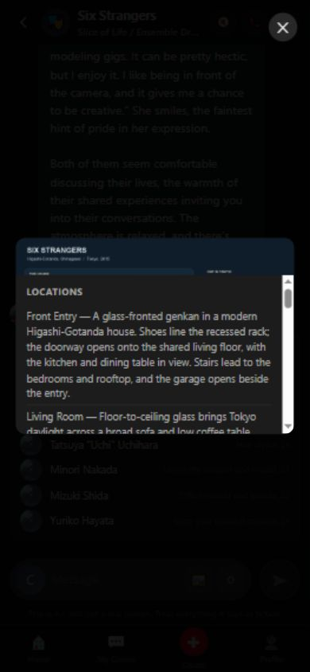
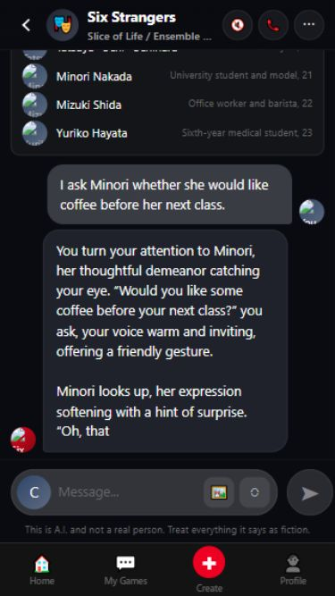

# Visible-browser UI audit and iOS smoothness plan

Date: 2026-09-19. Status: proposed work, informed by live UI inspection; no runtime changes made in this audit.

## Deployment and test setup

Fetched remote beta. Local HEAD and origin/beta both equal `c3e2a19ca01d8ba07f5e1e88aeda13910d55f3d7`. Railway beta deployment `23b0daa3-f2b6-4302-9ec1-e822f2f122da` reports SUCCESS for that commit. The latest committed game is therefore already pushed and deployed; no redundant deployment was needed. Local audit documents and the pre-existing untracked persona package file are not additional shipped gameplay.

Opened the actual https://storieschat.ai/beta/ page in a visible Codex browser. Resumed the existing Six Strangers guest game, opened Cast and World Map, tried Persona, composed and sent a coffee invitation, observed reply rendering, and tested tap-to-finish typing. Inspected at 390×844 and 375×667 CSS viewports. A landscape capture at 844×390 was clipped by the visible browser presentation and is not reliable evidence of a site landscape defect.

These are desktop-browser responsive checks, not an iOS simulator or real Safari session. No real software keyboard, notch, Safari toolbar collapse, VoiceOver, or background-tab suspension was tested. Those are explicit acceptance tasks below. The built-in browser already provides screenshots, DOM inspection and viewport control; installing an unrelated website-viewing repository was unnecessary.

## Confirmed findings

| Priority | Finding and evidence | Proposed change |
|---|---|---|
| P1 | Portraits visibly broken in chat and all six Cast rows. DOM reports loaded images with zero natural width. `https://storieschat.ai/img/characters/Mizuki_Shida.png` returns 404; beta API host's identical path returns 200 image/png. | One environment-aware asset URL resolver, used for player, NPC, roster and header art. Add a reliable initials fallback. Test hosted URLs rather than only checking source filenames. |
| P1 | World Map opens, but the locations panel covers most of the map at 390px. | Separate Map and Locations tabs in a full-height phone sheet; give the diagram its own pan/zoom area and the list its own scroll region. Accessible close button and focus return. |
| P1 | Reply continues simulated typing well after the network response. Source creates a text node per character and forces bottom scrolling after every character. Tap-to-finish works but is undiscoverable. | Default to immediate paragraph rendering or actual streamed chunks. Keep an optional animation with visible Skip, reduced-motion support, batched DOM updates, and follow-scroll only while the reader is near the bottom. |
| P2 | Composer textarea is 15px; several visible controls measure 34×34px. At 390px the textarea has only 160px of width. | Use at least 16px input text, 44×44 CSS-pixel minimum touch regions as the project target, and one attachment/action menu instead of multiple inline placeholders. Preserve a generous Send target. |
| P2 | Persona shows “Persona switch coming soon.” Source confirms Mute, Voice and Image are also placeholder actions. | Hide unimplemented controls from the main chat toolbar, or label them clearly in a secondary feature-preview area. Make Persona functional before promoting it. |
| P2 | Cast roles are tiny, faint and horizontally squeezed beside names; Makoto's name wraps. | Stack name and role, use readable secondary type, reserve portrait dimensions, and use “Living here” instead of ambiguous “Present.” Keep future residents hidden. |
| P2 | Chat menu exposes Debug Info, Truth Mode and Epistemic State to ordinary guest players. | Move diagnostics to an explicit developer surface. Player menu should emphasize Housemates, Map, Journal/Plans, settings and exit. Preserve server authorization independently of UI visibility. |
| P2 | Long narrative bubbles require extensive scrolling, and the global bottom navigation consumes scarce chat space. | Compact-response preference, shorter routine beats, more space for text, and a focused chat shell with a dependable Back action. Keep navigation discoverable outside the active scene. |
| P2 | Viewport meta requests maximum-scale=1 and user-scalable=no. Enter handler lacks composition guard. | Remove zoom restrictions. Handle IME composition safely; distinguish mobile Return/newline behavior from explicit Send. Test dictation and Japanese/Chinese input. |

Screenshot evidence:

## iOS work, in implementation order

### 1. Correct assets and simplify controls

- [ ] Centralize environment-aware asset resolution; verify all 17 cast portraits and player fallback on hosted beta.
- [ ] Keep intrinsic dimensions and useful alt text; fall back once without an error loop.
- [ ] Remove prominent nonfunctional Voice/Image/Persona actions until usable.
- [ ] Rework roster text into two lines; measure contrast rather than judging only by eye.
- [ ] Add semantic buttons, accessible menu names, expanded state and keyboard operation where current controls are clickable containers.

Acceptance: no broken images; all primary actions do something useful; no tiny adjacent hit targets; roster readable at 375px and enlarged text.

### 2. Keyboard-safe chat shell

- [ ] Use a flex/grid shell with a bounded message scroller and anchored composer; use `min-height:0` on scroll children.
- [ ] Adopt dynamic viewport sizing with a fallback; account for safe-area top, bottom and landscape sides without double padding.
- [ ] Use VisualViewport only where testing demonstrates the need; handle resize/scroll with throttling and cleanup. `100dvh` alone is not a guarantee against keyboard bugs.
- [ ] Avoid automatic focus on every chat entry/resume, which can unexpectedly summon a phone keyboard.
- [ ] Keep a session-scoped draft through navigation/backgrounding. Save unsent text before clearing; offer retry after failure.
- [ ] Guard Enter with `isComposing` and composition state. Test multiline text, dictation, emoji and IME candidate confirmation.
- [ ] Allow page zoom and large text.

Acceptance on real iPhone: composer and Send stay visible during keyboard open/close, rotation and Safari-toolbar changes; no blank bottom strip; no accidental send during IME selection; closing the keyboard preserves reading position and draft.

### 3. Smooth reading and resilient sending

- [ ] Remove mandatory post-response character animation; honor reduced motion and user-selected speed.
- [ ] Track whether the reader is near the bottom. If they scroll upward, stop following new text and show a New reply button.
- [ ] Render chunks at a bounded rate, reserve image space, and preserve scroll anchor when older history loads.
- [ ] Expose sending/waiting/retry state without pretending the NPC is typing for minutes.
- [ ] Pair client-generated turn IDs with server idempotency before automatic retry. Preserve failed draft and prevent duplicate turns after weak-network recovery.
- [ ] Measure time to first readable text and complete reply separately from model latency.

Acceptance: reading history is never interrupted by forced scrolling; tapping Skip completes immediately; repeated send/retry creates one turn; airplane-mode recovery does not lose text.

### 4. Map and scene tools

- [ ] Replace the overlapping map/list layout with a responsive sheet: distinct tabs, useful zoom, clear current location.
- [ ] Keep map navigation distinct from committing travel; show valid destinations and travel time before movement.
- [ ] Put Housemates in a sheet rather than repeatedly inserting utility output into conversation history.
- [ ] Add concise, authoritative place/time/people context when the backend supports it. Do not fabricate UI state from narrative text.
- [ ] Keep ordinary replies compact; offer richer descriptions as a preference, not an extra wait imposed on everyone.

Acceptance: map is legible at phone width; close/back works with touch and VoiceOver; sheets do not scroll the page underneath; opening tools does not advance the game or lose the draft.

## Test tooling and coverage

Use the existing visible browser for fast manual checks. For repeatable repository tests, adopt the official [Microsoft Playwright project](https://github.com/microsoft/playwright) via its package, rather than copying an unknown automation repo. [Device emulation](https://playwright.dev/docs/emulation) supplies viewport/touch/device settings; add Chromium and WebKit runs. WebKit emulation is useful regression coverage but is not real iPhone Safari, and Windows cannot provide Apple's iOS Simulator.

Real-device sign-off should use a physical iPhone with Safari, or a separately selected device-testing service. macOS/Xcode is the route for Apple's simulator. No paid account or device service was provisioned here.

Test matrix: 375×667, 390×844, 430×932, phone landscape, and iPad split view; current supported iOS Safari and one previous supported version; regular tab and Home Screen mode if offered. Add larger text, VoiceOver, reduced motion, Japanese/Chinese IME, dictation, slow network, disconnect/reconnect, background/resume, long history and keyboard transitions.

Automated scenarios: start/resume guest game; send and retry once; open/close Cast and Map; image load/fallback; draft restoration; no unintended scroll jump; no horizontal overflow; modal focus and semantic controls; build identity and beta asset routing. Use synthetic fixtures for repeatability plus a small deployed smoke suite. Retain screenshots/traces on failure.

Technical references: [WebKit safe-area guidance](https://webkit.org/blog/7929/designing-websites-for-iphone-x/), [dynamic viewport support](https://webkit.org/blog/12669/new-webkit-features-in-safari-15-5/), and [Apple's Safari design guidance](https://developer.apple.com/videos/play/wwdc2021/10029/). These inform the implementation; they do not substitute for actual device testing.

## Delivery boundaries

First delivery: fix asset routing, remove placeholder clutter, improve roster/map, and eliminate mandatory slow typing. Second: keyboard/draft/scroll behavior and server-backed retry safety. Third: real-device acceptance and accessibility/performance polish. Update UI and deployment documentation with each shipped change, expose deployed build identity, and verify on the hosted beta before claiming iOS readiness.

This plan complements the prior gameplay audit. It does not resolve the narrative problems already identified: future-resident leakage, uninvited NPC presence, and incomplete lifecycle simulation.
