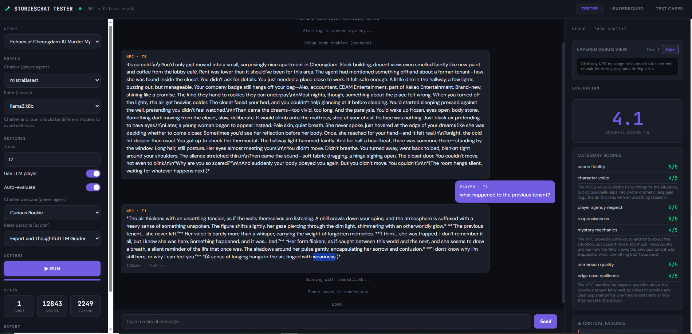

Documentation map (what to read for which need)
Instructions to AI:
- Use this doc (\documentation\ai_1_guide_to_docs.md) to find which docs document what. update this doc if ever needed
- Update this doc as needed (There is a line which says "Only Update Material After This LINE ", only update this doc AFTER that line, leave these instructions)
- Update all docs as needed, except any docs under human_north_star_docs
- Don't be lazy and always rememember to update docs with any changes or learnings 
- After making code changes always add a descriptive comment and push the code.
- Always boldly disagree with me when you feel like something doesnt make sense, dont be shy. and always ask questions if something is unclear.

==== Only Update Material After This LINE ====

- [documentation/ai_learnings_mistakes/ai_create_new_flag.txt](documentation/ai_learnings_mistakes/ai_create_new_flag.txt): How to add new bracket commands ([H]/[HINT]) across backend + frontend with testing notes.
- [documentation/ai_learnings_mistakes/ai_fatal_mistakes.txt](documentation/ai_learnings_mistakes/ai_fatal_mistakes.txt): Postmortem on blank-page incident; guards to avoid orphaned frontend code and how to recover.
- [documentation/ai_learnings_mistakes/ai_game_structure.txt](documentation/ai_learnings_mistakes/ai_game_structure.txt): Story/game asset layout (story folders, knowledge indexes, maps, UUID rules), **canonical facts rules** (confidence always 1.0, known_by filtering, character_self_knowledge vs epistemic_seed distinction), and steps to author a new case.
- [documentation/ai_learnings_mistakes/ai_learnings_integration_requirements.txt](documentation/ai_learnings_mistakes/ai_learnings_integration_requirements.txt): Integration test requirements—conda env, .env.test/OPENAI_API_KEY, commands for Windows/Railway, scenario expectations.
- [documentation/ai_learnings_mistakes/ai_learnings_pushing_code.txt](documentation/ai_learnings_mistakes/ai_learnings_pushing_code.txt): How AI pushes code (git auth, safe staging/commits, branch norms main/beta/prod).
- [documentation/ai_learnings_mistakes/ai_learnings_running_tests.txt](documentation/ai_learnings_mistakes/ai_learnings_running_tests.txt): Known-good pytest commands (full/unit/integration) for Windows with get_output_via_markers wrapper; pre-flight checklist.
- [documentation/ai_learnings_mistakes/ai_ui_workflow.txt](documentation/ai_learnings_mistakes/ai_ui_workflow.txt): Frontend single-file architecture and state machine (menu→name→gender→chat, commands, map rendering, error guards, API calls).
- [documentation/ai_learnings_mistakes/ai_scorer_system.txt](documentation/ai_learnings_mistakes/ai_scorer_system.txt): Scorer/grader system — file locations, architecture (FastAPI+embedded UI), WebSocket run flow, 7 scoring dimensions with weights, critical failures, context modal, leaderboard, test cases, personas, story context API, and common gotchas (3rd-person self-ref, player agency violations, debugPayloads dependency).

- [documentation/auto_update_docs/ARCHITECTURE_DIAGRAM.mmd](documentation/auto_update_docs/ARCHITECTURE_DIAGRAM.mmd): Mermaid architecture diagram covering client/API/engine/knowledge layers.
- [documentation/auto_update_docs/COMPREHENSIVE_DOCUMENTATION.md](documentation/auto_update_docs/COMPREHENSIVE_DOCUMENTATION.md): Full generated system manual with file-by-file notes and architecture narrative.
- [documentation/auto_update_docs/QUICK_REFERENCE.md](documentation/auto_update_docs/QUICK_REFERENCE.md): Condensed index of files, endpoints, commands, and key constants.

- [documentation/human_north_star_docs/NorthStar.md](documentation/human_north_star_docs/NorthStar.md): Vision doc for the narrative engine (state/time/incentives/constraints, two-call loop philosophy).
- [documentation/human_north_star_docs/StoriesChatNorthStar.txt](documentation/human_north_star_docs/StoriesChatNorthStar.txt): One-paragraph north star summary of the game’s intent.
- [documentation/human_north_star_docs/epistemic_state/EpistemicStateJennieIntegrationTestExample.md](documentation/human_north_star_docs/epistemic_state/EpistemicStateJennieIntegrationTestExample.md): Detailed IU/Bob/Steve interrogation script used for epistemic tests and layer mapping.

- [documentation/model_output_docs/CHARACTER_GRAPH_DESIGN.md](documentation/model_output_docs/CHARACTER_GRAPH_DESIGN.md): **Implemented** character relationship graph — multi-dimensional edges (trust/fear/affection/suspicion) between characters, injected into system prompt. Module: `backend/app/engine/character_graph.py`. Phase 1 (backward-compat with rel_delta) is live.
- [documentation/model_output_docs/EPISTEMIC_ENGINE_DESIGN.md](documentation/model_output_docs/EPISTEMIC_ENGINE_DESIGN.md): North-star-aligned epistemic design with strict in-memory contract (only retrieval indexes, objects, graphs), belief clarification, and runtime guardrails.
- [documentation/model_output_docs/EPISTEMIC_ENGINE_TODO.md](documentation/model_output_docs/EPISTEMIC_ENGINE_TODO.md): Simplified phased implementation plan (truth vs belief enforcement, transient buffer integration, and tests).
- [documentation/model_output_docs/TRANSIENT_BUFFER_DESIGN.md](documentation/model_output_docs/TRANSIENT_BUFFER_DESIGN.md): Scene-memory policy for vivid short-lived details, reset/TTL rules, and promotion criteria into canonical state.
- [documentation/model_output_docs/epistemic_harness_plan.md](documentation/model_output_docs/epistemic_harness_plan.md): Harness status/plan for epistemic layer toggles and scenario coverage.
- [documentation/model_output_docs/old designs/EPISTEMIC_REDESIGN.md](documentation/model_output_docs/old%20designs/EPISTEMIC_REDESIGN.md): Archived redesign notes (historical context only; superseded by current epistemic design/todo docs).
- [documentation/model_output_docs/INTEGRATION_TEST_PLAYBACK_DESIGN.md](documentation/model_output_docs/INTEGRATION_TEST_PLAYBACK_DESIGN.md): Scenario/step registry + UI playback design for integration tests (cached vs live LLM, assertions).
- [documentation/model_output_docs/layer_coverage_mapping.md](documentation/model_output_docs/layer_coverage_mapping.md): Mapping of IU scenario segments to epistemic layers and how toggle tests assert them.
